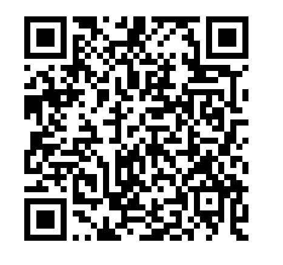
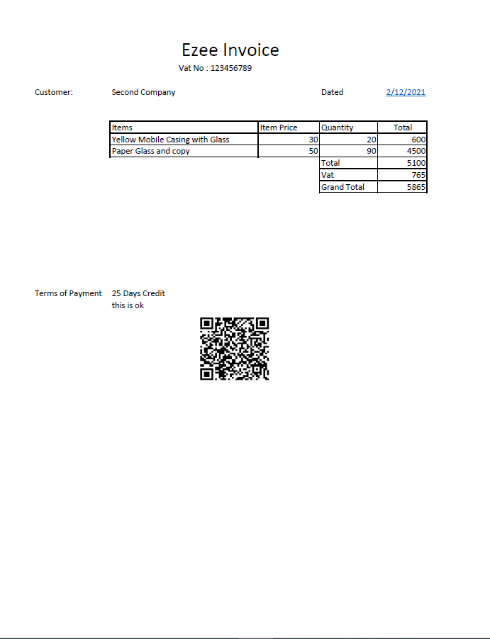

# Ezee Invoice
## Invoice With Qr Code Base64 Endoced
## As per the Requirements of Vat authorities.

There are several requirements of the QR Systems these days, It is a simple project to create a complete purchase cycle and at the end it will provide the invoice with a QR Code As per the requierments of ZACTA. The requirements of QR contains five fields in a Required Format.

These QR Code 5 Fields Includes.

1. Seller's Name
2. VAT Registeration No of Seller
3. Time Stamp fo the Invoice (Date and Time)
4. Invocie Total (with VAT)
5. VAT Total

Following are some Features of the Ezee Invoice Project.

1. User Should enter the Products and Companies.
2. Users should Login to Create Invoice.
3. Creates the Invoices with QR Code (As required by ZACTA).
4. Flexibale with any Database, OnPrim or Cloud

The project is underconstruction and the Goal is to make a complete application as required by ZACTA Invoicing.

Upcoming

1. Support for Business to Customer (normal QR code without base64 Encodeing)
2. Communicating between the other party system to Ezeinvoice to push the data through Zacta API.
3. Download invoice functions. Inclusions of UUID.
4. Improvement of Forms. 

Please DM me if you face any problem in setting up Ezee Invoice Setup

Contributions are welcomed# EzeeInvoiceQR

