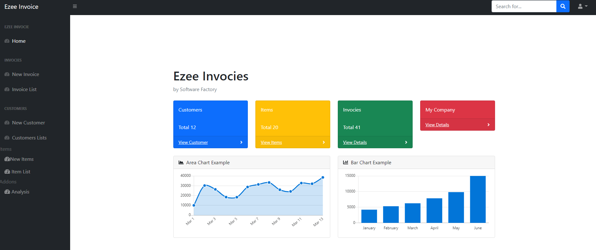
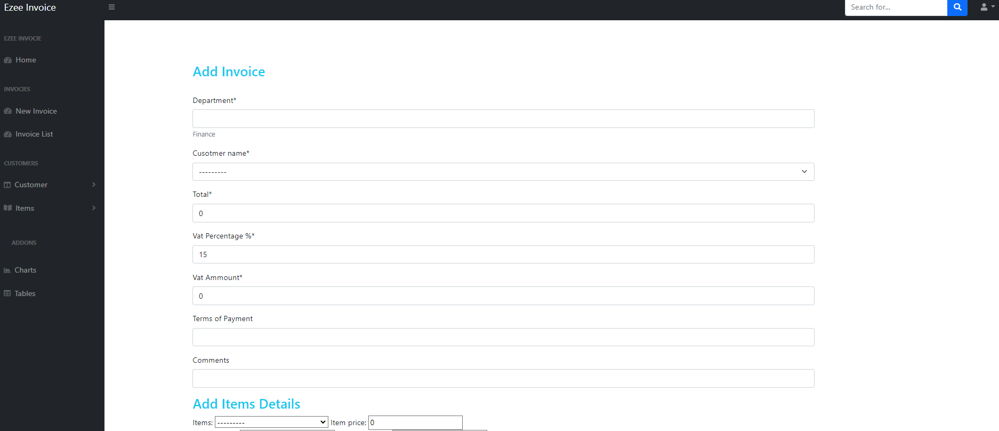

# Ezee Invoice
## Invoces With Qr Code Base65 Endoced

There are several requirements of the QR Systems these days, It is a simple project to create a complete purchase cycle and at the end provide the QR Enabled Invoices. As per the requirements QR contains five fields and different QR Codes for B2B and B2C.

Following are some Features of the Project.

1. Creates Invoices.
2. Users should Login to Create Invoice.
3. Creates the Invoices with QR Code.
4. Can be used with any database setup at any Cloud or On Prim.

The project is underconstruction

Upcoming

1. Support for Business to Customer (normal QR code without base64 Encodeing)
2. Communicating between the other party system to Ezeinvoice to push the data through API.
3. Download invoice functions. Inclusions of uuid
4. Improvement of Forms. 

Please DM me if you face any problem in setting up Ezee Invoice Setup

Contributions are welcomed# EzeeInvoiceQR
# EzeeInvoiceQR
# EzeeInvoiceQR
